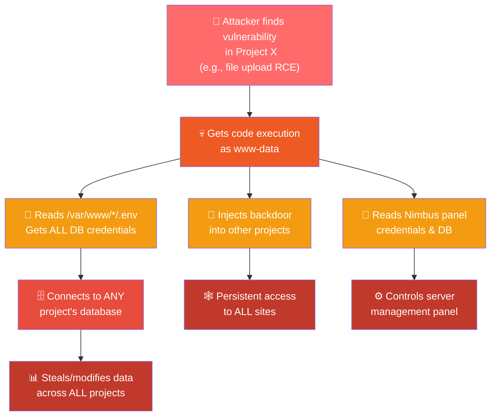

# 🔒 Server Security Isolation Report

**Server:** `66.116.204.19` · **OS:** Ubuntu 22.04.5 LTS · **Panel:** Nimbus (Laravel-based)  
**Date:** September 18, 2026 · **Audit Type:** Read-only, non-invasive

---

## ⚡ TL;DR — The Answer

> [!CAUTION]
> **YES — If one project is hacked, it CAN and WILL affect ALL other projects on this server.**
> 
> There is **zero project isolation**. All ~30+ projects run as the **same OS user** (`www-data`), share the **same PHP-FPM worker pool**, and can freely read each other's files — including database credentials, API keys, and application secrets.

---

## 🏗️ Server Overview

| Component | Details |
|-----------|---------|
| **OS** | Ubuntu 22.04.5 LTS (Jammy) |
| **Web Server** | Nginx (main on 80/443, Nimbus panel on 2095) |
| **PHP** | PHP 8.2 + PHP 8.3 (FPM) |
| **Database** | MySQL 8.x (local socket auth for root) |
| **Panel** | Nimbus at `/usr/local/nimbus` (Laravel + SQLite) |
| **Projects** | ~30+ sites under `/var/www/` |
| **Firewall** | UFW active (SSH, HTTP/S, Mail ports open) |

### Projects Hosted (Partial List)

| Project | Type |
|---------|------|
| pos.sudhirrajai.com | React + Laravel API |
| haarmonaa.vmcore.in | Laravel (Inertia) |
| haarmonaa-ratings.vmcore.in | Nuxt/Node.js |
| tracker.vmcore.in | Laravel |
| dmanindia.com | Laravel |
| maharaj.sudhirrajai.com | Node.js backend |
| mangalsai-uat.ownsoftwaresolutions.com | Laravel |
| webmail.vmcore.in | Roundcube mail |
| sudhirrajai.com | Laravel |
| + 20 more sites... | Various |

---

## 🚨 Critical Findings — Cross-Project Impact

### 1. ALL Projects Run as the SAME User (`www-data`)

> [!CAUTION]
> **Severity: CRITICAL** — This is the single biggest isolation failure.

Every project directory under `/var/www/` is owned by `www-data:www-data`:

```
drwxrwsr-x+ www-data www-data pos.sudhirrajai.com
drwxrwsr-x+ www-data www-data haarmonaa.vmcore.in
drwxrwsr-x+ www-data www-data tracker.vmcore.in
drwxrwsr-x+ www-data www-data dmanindia.com
... (ALL projects)
```

**Impact:** If a hacker exploits a vulnerability (e.g., file upload RCE, SQL injection + file write) in **any one project**, the PHP/Node process runs as `www-data` and can:
- ✅ **Read** every other project's source code
- ✅ **Read** every other project's `.env` files (DB passwords, API keys, APP_KEY)
- ✅ **Write/Modify** files in every other project
- ✅ **Inject backdoors** into every other project
- ✅ **Drop webshells** in any project's public directory

---

### 2. Shared PHP-FPM Pool — No Per-Site Process Isolation

> [!WARNING]
> **Severity: CRITICAL**

All projects share the **same `www` PHP-FPM pool**:

```ini
# /etc/php/8.3/fpm/pool.d/www.conf
[www]
user = www-data
group = www-data
listen = /run/php/php8.3-fpm.sock
```

Only one project (`testme`) has its own pool, but it **still runs as `www-data`**:

```ini
# /etc/php/8.3/fpm/pool.d/testme.conf
[testme]
user = www-data     # <-- Still www-data!
group = www-data
listen = /run/php/php8.3-fpm-testme.sock
```

**Impact:** A single compromised PHP request can execute code that affects all other sites because they share the same process user context.

---

### 3. No `open_basedir` Restriction

> [!WARNING]
> **Severity: CRITICAL**

```ini
# Both PHP 8.2 and 8.3
open_basedir => no value => no value
```

`open_basedir` is **completely disabled**. PHP scripts from any project can access **any file on the entire filesystem**, not just their own project directory.

**Impact:** A hacked project can read:
- `/var/www/*/` — all other project files
- `/usr/local/nimbus/.env` — Nimbus panel database
- `/usr/local/nimbus/.credentials` — MySQL root-equivalent credentials
- `/root/.my.cnf` — MySQL root password
- `/etc/passwd`, `/etc/shadow` (if readable) — system accounts

---

### 4. No `disable_functions` in PHP

> [!WARNING]
> **Severity: HIGH**

```ini
# Both PHP 8.2 and 8.3 FPM
disable_functions = (empty)
```

Dangerous PHP functions like `exec()`, `system()`, `passthru()`, `shell_exec()`, `proc_open()`, `popen()` are **all available**. 

**Impact:** Once code execution is achieved through any project, the attacker can:
- Run arbitrary shell commands as `www-data`
- Download and install additional malware/rootkits
- Pivot to other projects, read/modify databases
- Potentially escalate to root

---

### 5. `.env` Files Readable Across Projects

> [!CAUTION]
> **Severity: CRITICAL**

Verified that `www-data` can read **any project's `.env` file**:

```bash
# Confirmed: www-data CAN read other project's credentials
$ sudo -u www-data cat /var/www/pos.sudhirrajai.com/backend/.env
DB_USERNAME=pos_user
DB_PASSWORD=PosUser123@

$ sudo -u www-data cat /var/www/tracker.vmcore.in/.env
DB_USERNAME=tracker_user
DB_PASSWORD="Sudhir123@"
```

**All DB credentials found across projects:**

| Project | DB User | DB Name |
|---------|---------|---------|
| pos | `pos_user` | `pos` |
| haarmonaa | `haarmonaa` | `haarmonaa` |
| tracker | `tracker_user` | `tracker` |
| dmanindia | `dman_india` | `damn_india` |
| wrytindia | `wrytindia` | `wrytindia` |
| ... | ... | ~38 databases total |

---

### 6. Nimbus Panel Credentials Exposed

> [!CAUTION]
> **Severity: CRITICAL**

The Nimbus panel's credential file at `/usr/local/nimbus/.credentials` is world-readable and contains the Nimbus DB password. Additionally, the MySQL root password is stored in plaintext at `/root/.my.cnf`:

```
# /root/.my.cnf
[client]
user=root
password=4fDjwVdjBuEtW[JP
```

While `/root/.my.cnf` requires root to read, the Nimbus credentials file and the panel's `.env` are owned by `www-data`, meaning any hacked project can reach the panel's database.

---

### 7. ACL Grants Give `www-data` Group Full Access

Every project directory has POSIX ACLs granting the `www-data` group **full rwx** access:

```
# ACL on /var/www/pos.sudhirrajai.com
user::rwx
group::rwx
group:www-data:rwx    # <-- Any www-data member has FULL access
default:group:www-data:rwx
```

The Nimbus SSH users (`nimbus_jagdish`, `nimbus_abhishek`, `nimbus_vishal`, `nimbus_raj`) are all members of the `www-data` group, meaning they can also access **all project files** via SFTP/SSH.

---

### 8. Multiple Users Have `sudo` Access

| User | Groups | Risk |
|------|--------|------|
| `sudhir` | sudo | Can become root |
| `vishal` | sudo | Can become root |
| `nimbus_jagdish` | www-data | Access to all project files |
| `nimbus_abhishek` | www-data | Access to all project files |
| `nimbus_vishal` | www-data | Access to all project files |
| `nimbus_raj` | www-data | Access to all project files |

---

## ✅ What's Done Right

| Control | Status | Notes |
|---------|--------|-------|
| **UFW Firewall** | ✅ Active | Only needed ports open |
| **SSL/TLS** | ✅ Enabled | Let's Encrypt on all sites |
| **MySQL User Isolation** | ✅ Partially | Each project has its own DB user with grants limited to its own database |
| **Nginx Security Headers** | ✅ Present | X-Frame-Options, X-Content-Type-Options, XSS-Protection |
| **Hidden File Denial** | ✅ Configured | `.env`, `.git` blocked from web access |
| **AppArmor** | ✅ Loaded | 42 profiles in enforce mode (but not covering PHP/Nginx) |
| **MySQL on Localhost** | ✅ | Not exposed to the internet |
| **Nimbus Panel on Separate Port** | ✅ | Runs on port 2095 with its own Nginx instance |

---

## 🔥 Attack Scenario: One Project Hacked → All Projects Compromised



**Step-by-step:**
1. Attacker exploits a vulnerability in any one of your ~30 projects
2. Gains PHP/shell code execution as `www-data`
3. Reads `.env` files of ALL other projects → gets DB passwords and APP_KEYs
4. Connects to any/all MySQL databases and dumps data
5. Injects PHP webshells or backdoors into other project directories
6. Reads Nimbus panel credentials → takes over server management
7. All projects are now fully compromised

---

## 📋 Recommended Fixes (Priority Order)

### P0 — Immediate (Do This Week)

| # | Fix | What It Does |
|---|-----|--------------|
| 1 | **Create per-site system users** | Each project gets its own Linux user (e.g., `site_pos`, `site_haarmonaa`). Project files owned by that user. |
| 2 | **Create per-site PHP-FPM pools** | Each pool runs as its site user. If one site is hacked, PHP can only access that site's files. |
| 3 | **Set `open_basedir` per pool** | Restrict each PHP pool to only its own `/var/www/site_name/:/tmp/` |
| 4 | **Set `disable_functions`** | Disable `exec, system, passthru, shell_exec, proc_open, popen, curl_exec, curl_multi_exec` in FPM |
| 5 | **Fix `.env` file permissions** | `chmod 600` all `.env` files, owned by the site's user only |

### P1 — This Month

| # | Fix | What It Does |
|---|-----|--------------|
| 6 | **Remove Nimbus users from `www-data` group** | Create a separate group per project instead |
| 7 | **SFTP chroot per user** | Add `ChrootDirectory` and `ForceCommand internal-sftp` in sshd_config |
| 8 | **Secure MySQL root** | Remove plaintext password from `.my.cnf`, use socket auth only |
| 9 | **Secure Nimbus `.credentials`** | Restrict to `600` and root ownership |
| 10 | **Restrict `sudhir`/`vishal` sudo** | Consider using specific sudoers rules instead of full sudo |

### P2 — Next Quarter

| # | Fix | What It Does |
|---|-----|--------------|
| 11 | **Docker/container per project** | Full process + filesystem + network isolation |
| 12 | **AppArmor profiles for PHP-FPM** | Mandatory access controls per pool |
| 13 | **WAF (ModSecurity/Nginx NAXSI)** | Web application firewall for common attacks |
| 14 | **Audit logging** | Monitor file access, SSH logins, DB queries |
| 15 | **Automated backup & integrity checks** | Detect unauthorized file changes |

---

## Summary

| Isolation Layer | Current Status | Risk Level |
|----------------|---------------|------------|
| **OS User Isolation** | ❌ All `www-data` | 🔴 CRITICAL |
| **PHP-FPM Pool Isolation** | ❌ Shared pool | 🔴 CRITICAL |
| **Filesystem Isolation** (`open_basedir`) | ❌ Disabled | 🔴 CRITICAL |
| **Dangerous PHP Functions** | ❌ All enabled | 🟠 HIGH |
| **Database User Isolation** | ✅ Per-project DB users | 🟢 GOOD |
| **Network Firewall** | ✅ UFW active | 🟢 GOOD |
| **SSL/TLS** | ✅ Let's Encrypt | 🟢 GOOD |
| **Nginx Security Headers** | ✅ Present | 🟢 GOOD |

> [!IMPORTANT]
> **Bottom line:** Your server is a shared hosting environment with NO project isolation at the OS level. The MySQL database isolation is the only barrier, but since all `.env` files are readable by the same `www-data` user, even that barrier is ineffective. A compromise of **any single project** gives an attacker access to **everything**.
